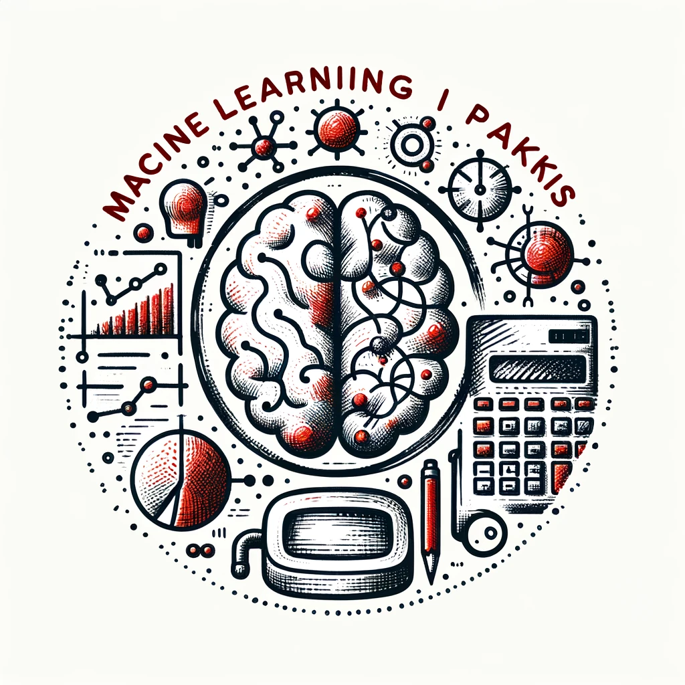

#  Machine Learning i praksis

Dette repository indeholder materialer til workshoppen "Machine Learning i praksis", der afholdes for Den danske Aktuarforening den 26.-27. februar, 2024.

**NB**: dette repository indeholder *ikke* case-data. 

## Installation

For at kunne afvikle notebooks og scripts i dette projekt skal relevante python-pakker installeres.

```bash
pip install -r requirements.txt
```

## Struktur

- Slides er skrevet som `jupyter notebooks` og placeret i folderen `./slides`
- Løsninger til *hands-on opgaven* udvikles i notebooks med præfix `lab_` og er placeret i roden af projektet
- Løsningerne er reduceret til python scripts med præfix `slim_` og placeret i roden af projektet
- Python-pakke med diverse nyttig workshop-specifik funktionalitet bor i folderen `./workshop`
